# GAN para Generar Imágenes de Prendas y Accesorios

> Jairo Andrades Bueno

Este repositorio contiene el código y los recursos necesarios para entrenar y generar imágenes de prendas de vestir y accesorios utilizando una Red Generativa Adversarial (GAN).

## Descripción

En este proyecto, implementamos una *Red Generativa Adversarial (GAN)* para crear imágenes de prendas de vestir y accesorios, utilizando el dataset *Fashion MNIST* para entrenarla.

## Estructura del Proyecto

- [`gan_prendas_Jairo_Andrades_Bueno.ipynb`](gan_prendas_Jairo_Andrades_Bueno.ipynb): Cuaderno principal donde se implementa y entrena la GAN.
- [`images/`](images/): Carpeta que contiene las imágenes generadas por la GAN.
- [`models/`](models/): Carpeta que contiene los modelos generador y discriminador entrenados.
- [`docker-compose.yml`](docker-compose.yml): Archivo de configuración para Docker Compose.
- [`Dockerfile`](Dockerfile): Archivo de configuración para Docker.
- [`requirements.txt`](requirements.txt): Archivo que lista las dependencias necesarias para ejecutar el proyecto.

## Entrenamientos

En las carpetas `images` y `models` encontraremos imágenes y modelos generados con distintos parámetros, es decir, modificando el batch size, el número de épocas, la cantidad de imágenes, etc.

| Entrenamiento | Batch Size | Épocas | Cantidad de Imágenes | Descripción |
|---------------|------------|--------|----------------------|-------------|
| 1             | 64         | 100     | 3.000                | Entrenamiento básico de prueba |
| 2             | 128        | 200    | 20.000                | Aumento de imágenes, batch size y épocas |
| 3             | 256        | 50    | 70.000                | Todas las imágenes, aumento de batch size, tuve que cortar a las 50 épocas |
| 4             | 256        | 50+175   | 70.000                | Continúa partiendo del modelo anterior hasta hacer otras 175 épocas más |

## Resultados

Como acabamos de ver, hay mucha diferencia entre los primeros modelos y los últimos. Estos dan resultados muy distintos, siendo los últimos mucho más detallados. A continuación, veremos las 5 imágenes de prueba que se han creado al final de cada entrenamiento:

### Entrenamiento 1

| Imagen 1 | Imagen 2 | Imagen 3 | Imagen 4 | Imagen 5 |
|----------|----------|----------|----------|----------|
| 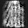 |  | 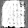 | 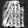 | 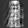 |

### Entrenamiento 2

| Imagen 1 | Imagen 2 | Imagen 3 | Imagen 4 | Imagen 5 |
|----------|----------|----------|----------|----------|
| 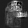 |  |  | 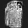 | 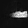 |

### Entrenamiento 3

| Imagen 1 | Imagen 2 | Imagen 3 | Imagen 4 | Imagen 5 |
|----------|----------|----------|----------|----------|
| 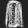 | 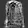 | 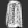 | 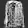 | 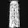 |

### Entrenamiento 4

| Imagen 1 | Imagen 2 | Imagen 3 | Imagen 4 | Imagen 5 |
|----------|----------|----------|----------|----------|
| 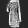 | 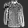 | 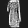 | 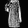 | 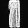 |

Aunque las imágenes sean tan pequeñas, al tener una resolución de 28x28, se puede apreciar una clara diferencia entre el primer modelo, que vagamente deja entrever las prendas de ropa y el último modelo, que genera imágenes en las que se puede apreciar la forma casi perfecta de la prenda, aunque la resolución siga sin estar al nivel de las originales.

